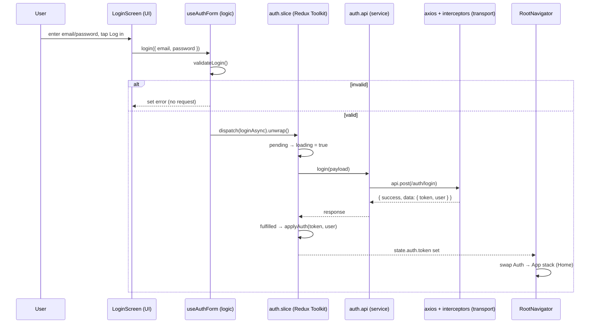

# Architecture & Data Flow

This document explains the layers of the app and how data moves through them,
using **login** as the worked example.

## Guiding idea

The app is **feature-sliced**: each feature (`auth`, `home`, …) owns its screens,
components, services, state slice, and types. Cutting across all features are a
few shared layers: `api`, `store`, `navigation`, `i18n`, and `shared`.

Within a feature, code is organized into **layers with a single direction of
dependency** — UI depends on logic, logic depends on state, state depends on
services, services depend on the transport layer. Nothing lower reaches back up.

```
UI (screen/components)
      │  calls
      ▼
Screen logic (hook: useAuthForm)      ← validation + orchestration
      │  dispatches
      ▼
State (Redux Toolkit slice)           ← client/session state
      │  calls
      ▼
Service (feature .api.ts)             ← "what" endpoint, typed payload/response
      │  uses
      ▼
Transport (axios instance + interceptors + endpoints)   ← "how" requests are sent
      │
      ▼
Network  (real API, or __DEV__ mock)
```

Server **reads** (e.g. the Home feed) take a parallel path through **React Query**
instead of Redux — see [Server state](#server-state-react-query).

---

## The layers

### 1. Presentation — screens & components
- **Where:** `features/<f>/screens/`, `features/<f>/components/`, `shared/components/`
- **Responsibility:** render UI, capture input, call the feature's logic hook.
- **Rule:** no API calls, no business rules here. Screens hold only local UI state
  (form field values) and delegate everything else.
- **Example:** `features/auth/screens/LoginScreen.tsx` holds `email`/`password`
  and calls `login()` from the hook.

### 2. Screen logic — feature hooks
- **Where:** `features/<f>/hooks/` (e.g. `useAuthForm.ts`)
- **Responsibility:** validation, orchestration, and exposing a clean API
  (`login`, `signup`, `loading`, `error`, `clearError`) to the screen.
- **Rule:** talks to the state layer (dispatch Toolkit async actions / read selectors); never
  calls services or axios directly.
- **Example:** `useAuthForm` validates the email/password with `shared/utils`,
  then dispatches `loginAsync`.

### 3. State — Redux Toolkit slices
- **Where:** `features/<f>/<f>.slice.ts`, typed hooks in `store/hooks.ts`
- **Responsibility:** hold **client/session state** (auth token, user, loading,
  error) and coordinate async work with Redux Toolkit.
- **Rule:** the async action calls the service; reducers only transform state from the
  async action lifecycle (`pending` / `fulfilled` / `rejected`).
- **Example:** `auth.slice.ts` — `loginAsync` calls the service; `applyAuth`
  writes `token`/`user` into state on success.

### 4. Service — feature API modules
- **Where:** `features/<f>/services/<f>.api.ts`
- **Responsibility:** define *what* endpoint to hit and the typed request/response
  shape. One function per operation (`login`, `signup`, `logout`).
- **Rule:** uses the shared `api` transport; contains no UI or state logic.
- **Example:** `auth.api.ts` — `login()` does `api.post(AUTH_ENDPOINTS.LOGIN, payload)`.

### 5. Transport — axios instance, interceptors, endpoints
- **Where:** `api/axios.ts`, `api/interceptors.ts`, `api/endpoints.ts`, `api/devMock.ts`
- **Responsibility:** *how* requests are sent — base URL, timeout, attaching the
  auth token (request interceptor), handling `401` (response interceptor), and in
  `__DEV__`, returning mock responses so the app works with no backend.
- **Rule:** interceptors are installed once at startup (`setupInterceptors()` in
  `App.tsx`), which is why `axios.ts` doesn't import the store (avoids a cycle).

### Cross-cutting layers
- **`navigation/`** — `RootNavigator` switches Auth vs App stacks off
  `state.auth.token`; `navigationRef` lets the `401` handler redirect to Login.
- **`shared/`** — reusable components, `utils` (validation, error normalization),
  `types`, `constants`, `config` (env), `security` (SSL pinning).
- **`i18n/`** — i18next with English + Spanish.

---

## Worked example: login data flow

User types credentials on the Login screen and taps **Log in**.

1. **UI** — `LoginScreen.tsx`
   `onSubmit()` runs `await login({ email, password })` (from `useAuthForm`).

2. **Screen logic** — `useAuthForm.ts`
   `login()` runs `validateLogin()` (email format + password length via
   `shared/utils`). If invalid, it sets `validationError` and **returns early** —
   no network call. If valid, it dispatches the async action and returns its promise:
   `dispatch(loginAsync(payload)).unwrap()`.

3. **State** — `auth.slice.ts`
   `loginAsync` fires. `loginAsync.pending` sets `loading = true`, clears `error`.
   The async action calls the service: `await login(payload)`.

4. **Service** — `auth.api.ts`
   `api.post(AUTH_ENDPOINTS.LOGIN, payload)` — a typed POST returning
   `ApiResponse<AuthData>`.

5. **Transport** — `api/interceptors.ts` + `api/axios.ts`
   The request interceptor attaches `Authorization` if a token exists. The request
   goes out. In `__DEV__` with no backend, `devMock.ts` returns a canned success
   for `/auth/login` (test@example.com / Password123).

6. **Back up the stack — success**
   Service returns `{ success: true, data: { token, refreshToken, user } }`.
   The async action checks `success`, returns `data`. `loginAsync.fulfilled` runs
   `applyAuth`, writing `token`, `refreshToken`, `user` into Redux and clearing
   `loading`/`error`.

7. **Reactive navigation** — `RootNavigator.tsx`
   `RootNavigator` reads `state.auth.token` via `useAppSelector`. Now that it's
   set, it re-renders and swaps the **Auth** stack for the **App** stack → the user
   lands on Home. No manual `navigate()` call needed — navigation reacts to state.

### Error path
- **Validation error:** step 2 sets `validationError`; `useAuthForm` returns
  `error`, and `LoginScreen` shows it. No request is made.
- **Server/network error:** the service throws → `loginAsync` catches it via
  `rejectWithValue(getErrorMessage(err))` → `loginAsync.rejected` sets `error` and
  `loading = false` → the screen shows the message. `LoginScreen.onSubmit` also
  wraps the call in `try/catch` so the rejected promise never surfaces as an
  unhandled rejection.
- **401 on a later request:** the response interceptor dispatches `clearAuth()`
  and uses `navigationRef` to reset to Login.

### Sequence diagram



---

## Server state (React Query)

Login uses **Redux** because the token/session is **client state we own**. Data we
**read from the server** (the Home feed) uses **React Query** instead:

- `features/home/services/home.api.ts` → `fetchFeed()`
- `features/home/hooks/useHomeData.ts` → `useQuery({ queryKey: ['home','feed'], queryFn: fetchFeed })`
- `features/home/screens/HomeScreen.tsx` → consumes `data`, `isLoading`, `refetch`

React Query gives caching, dedup, `staleTime`, retries, and pull-to-refresh for
free — no slice/loading-flag boilerplate. **Rule of thumb:** server reads →
React Query; client/session/UI state → Redux.

---

## Extension points

- **Session persistence** — DONE: the token is saved to SecureStore and the user
  to AsyncStorage on login; `hydrateAuth` restores the session at startup.
- **Theme + language** — DONE: both persist and restore on startup.
- **SSL pinning** — scaffolded in `shared/security/sslPinning.ts`, disabled until
  pins are added.
- **Token refresh** — DONE: on 401 the interceptor calls `refreshSession()`
  (de-duplicated) and retries once before falling back to logout.
- **Resilience/observability** — global `ErrorBoundary`, a toast system
  (`shared/feedback`), and a vendor-agnostic `monitoring` seam are wired; React
  Query errors report + toast automatically.
